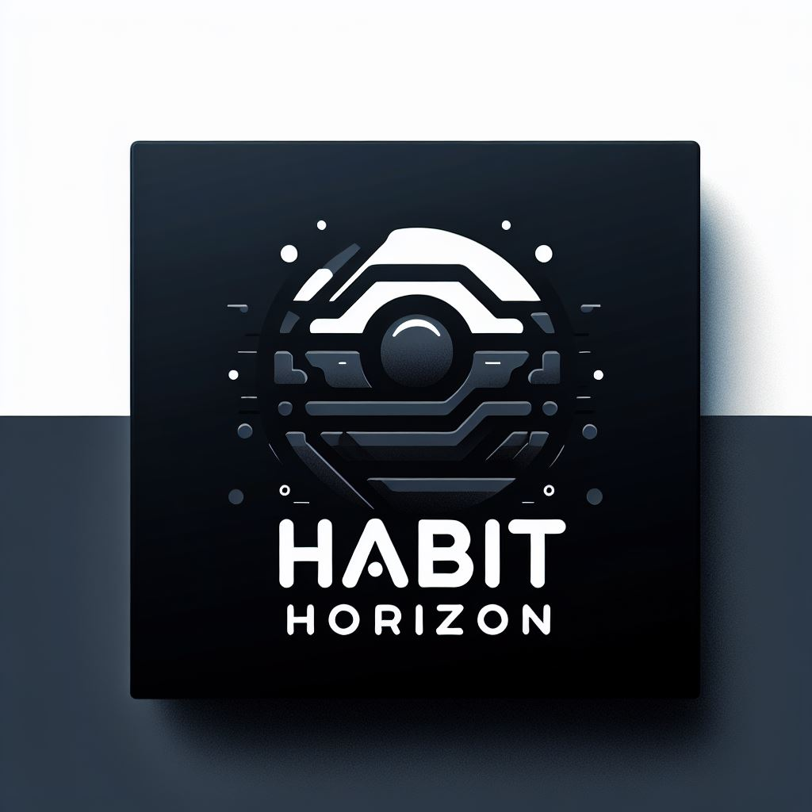

  <table>
    <tr>
      <td>
        
      </td>
      <td>
        <pre>
  _   _       _     _ _     _   _            _                
 | | | | __ _| |__ (_) |_  | | | | ___  _ __(_)_______  _ __  
 | |_| |/ _` | '_ \| | __| | |_| |/ _ \| '__| |_  / _ \| '_ \ 
 |  _  | (_| | |_) | | |_  |  _  | (_) | |  | |/ / (_) | | | |
 |_| |_|\__,_|_.__/|_|\__| |_| |_|\___/|_|  |_/___\___/|_| |_|
                                                   v2024.10.30
        </pre>
      </td>
    </tr>
  </table>

## Overview
**Habit Horizon** is a .NET application designed to help users catalog their goals and track their progress efficiently.

## Features (Planned)
- **Goal Cataloging and Tracking:**
  - Generate a basic ASCII checklist for a specified time interval, initially limited to a single month.

- **Enhanced Time Interval Selection:**
  - Select one or multiple months.
  - Choose specific week indices, multiple week indices, or a range of week indices.

- **Database Integration:**
  - Record the completion status of each week's goals in a database for persistent tracking.

- **Web Application Features:**
  - User sign-on functionality for personalized experiences.
  - Historical views with trend analysis on goals to visualize progress over time.
  - Journal entries for personal reflections and notes.
  - Dynamic scheduling for flexible goal management.
